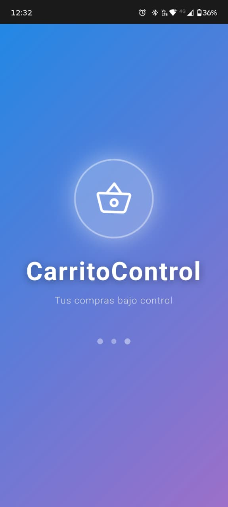
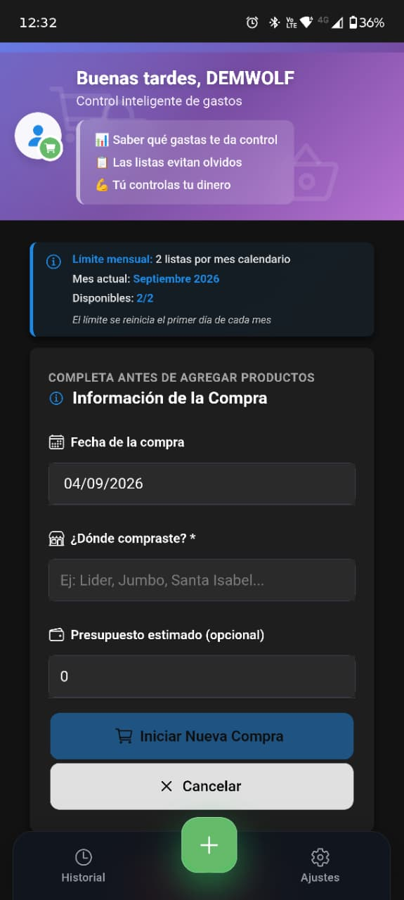
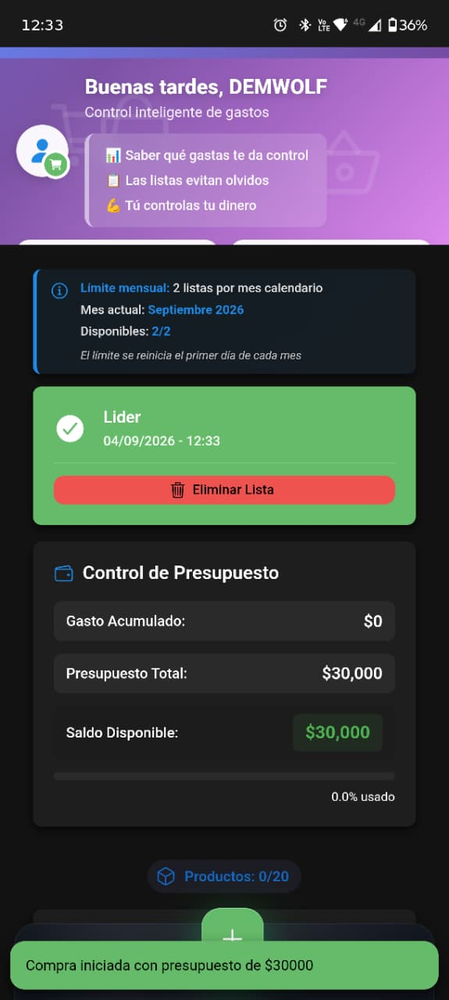
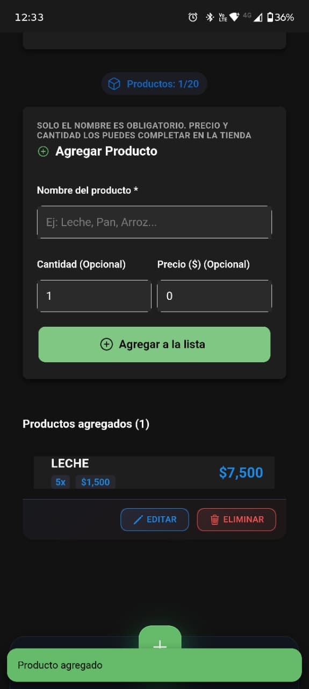
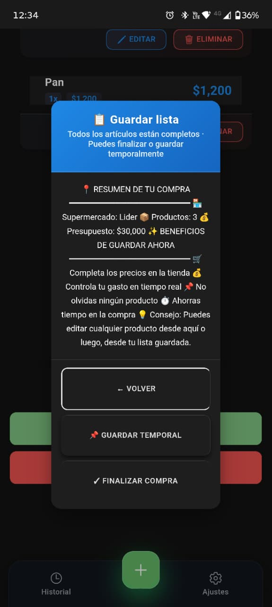
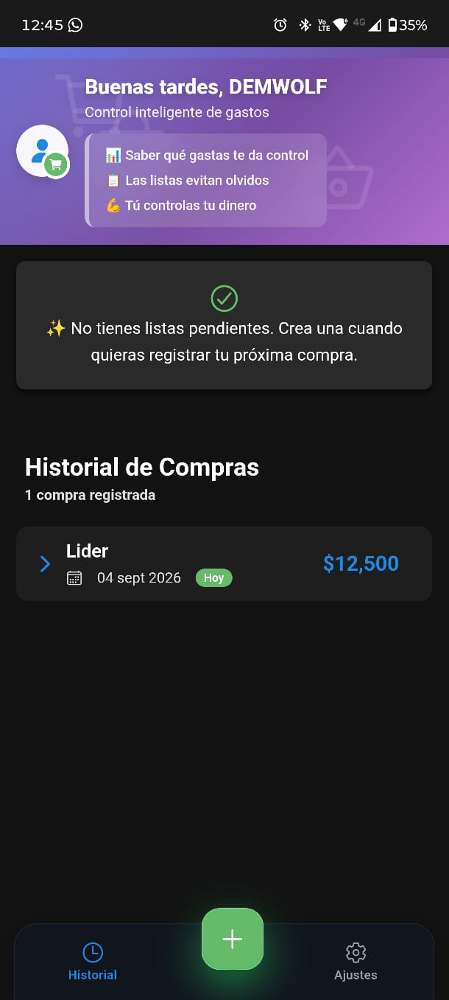
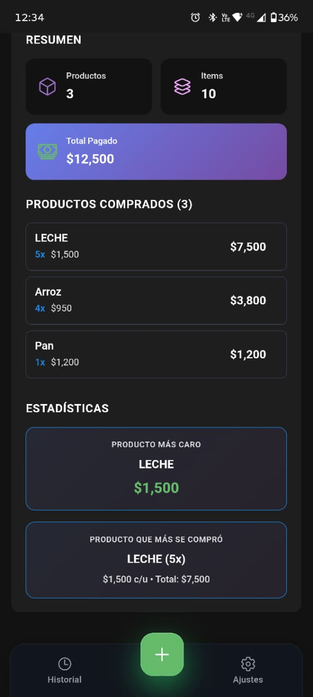
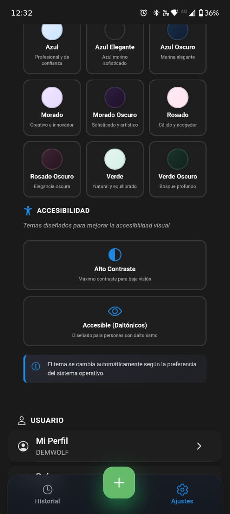
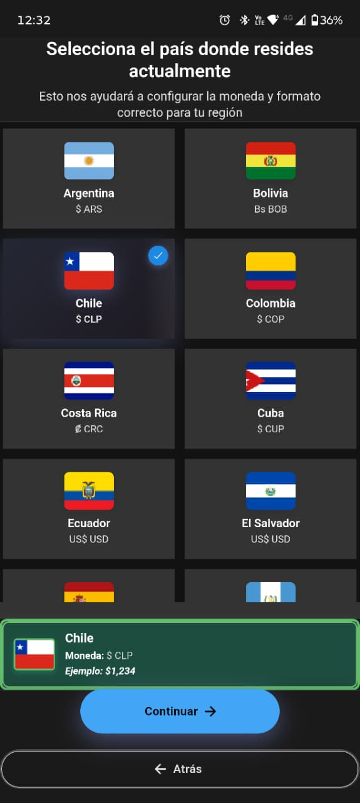

<div align="center">

# 🛒 CarritoControl

### Tus compras bajo control

Aplicación móvil para Android diseñada para organizar compras, controlar presupuestos en tiempo real y mantener un historial detallado de gastos.

<br>


<br>

## 📲 Probar CarritoControl

La versión actual puede instalarse directamente en dispositivos Android.

[](https://github.com/DemWolfXZ/carrito/raw/refs/heads/main/Carrito%20Control.apk)

</div>

---

# 📱 ¿Qué es CarritoControl?

**CarritoControl** es una aplicación móvil creada para facilitar la organización de compras y ayudar a mantener un mayor control sobre el dinero utilizado durante ellas.

La idea parte de una situación cotidiana: muchas veces una lista de compras permite recordar qué necesitamos, pero no necesariamente nos ayuda a saber cuánto llevamos gastado mientras estamos comprando.

CarritoControl combina ambas necesidades:

```text
Lista de compras
        +
Control de presupuesto
        +
Registro de productos
        +
Historial
        +
Estadísticas
```

El objetivo es poder responder rápidamente preguntas como:

- ¿Qué productos necesito comprar?
- ¿Cuánto dinero tengo disponible?
- ¿Cuánto llevo gastado?
- ¿Cuánto presupuesto me queda?
- ¿Cuántos productos diferentes compré?
- ¿Cuántas unidades compré en total?
- ¿Cuánto terminé pagando?
- ¿Qué compré anteriormente?

---

# ✨ Funcionalidades principales

## 🛒 Creación de compras

La aplicación permite iniciar una compra registrando información como:

- 📅 Fecha.
- 🏪 Lugar o supermercado.
- 💰 Presupuesto estimado.

Una vez creada la compra, es posible comenzar a incorporar los productos que se necesitan.

---

## 📋 Preparación de listas

CarritoControl permite utilizar la aplicación tanto **antes de realizar la compra** como durante ella.

El nombre del producto puede registrarse inicialmente sin necesidad de completar inmediatamente su precio.

Esto permite preparar previamente una lista como:

```text
Leche
Arroz
Pan
Huevos
Carne
```

y posteriormente completar cantidades y precios directamente durante la compra.

---

# 💰 Control de presupuesto

Una de las principales funcionalidades de CarritoControl es el seguimiento del presupuesto.

Durante la compra la aplicación calcula automáticamente:

- **Gasto acumulado**
- **Presupuesto total**
- **Saldo disponible**
- **Porcentaje del presupuesto utilizado**

Por ejemplo:

```text
Presupuesto total:     $30.000
Gasto acumulado:        $7.500
Saldo disponible:      $22.500

Presupuesto utilizado: 25 %
```

La información se actualiza a medida que se agregan o modifican productos.

---

# 📦 Gestión de productos

Cada producto puede incluir:

- Nombre.
- Cantidad.
- Precio unitario.
- Precio total calculado.

Por ejemplo:

```text
Leche

Cantidad: 5
Precio unitario: $1.500

Total: $7.500
```

La aplicación permite además:

- ➕ Agregar productos.
- ✏️ Editar productos.
- 🗑️ Eliminar productos.
- Modificar cantidades.
- Completar precios posteriormente.

---

## 📊 Productos vs. ítems

CarritoControl diferencia entre **productos diferentes** y la **cantidad total de unidades compradas**.

Ejemplo:

```text
Leche    5 unidades
Arroz    4 unidades
Pan      1 unidad
```

Resultado:

```text
Productos diferentes: 3
Ítems totales: 10
```

Esto permite obtener un resumen más preciso de cada compra.

---

# 📌 Guardado temporal

Una compra no tiene que finalizarse inmediatamente.

CarritoControl permite guardar una lista temporalmente para continuar trabajando en ella posteriormente.

El flujo puede ser:

```text
Crear compra
     ↓
Agregar productos
     ↓
Guardar temporalmente
     ↓
Ir al supermercado
     ↓
Completar cantidades y precios
     ↓
Controlar presupuesto
     ↓
Finalizar compra
```

Esto permite utilizar la misma aplicación tanto para **planificación** como para **registro en tiempo real**.

---

# ✅ Finalización de compras

Cuando la compra ha terminado, puede marcarse como completada.

La información pasa al historial y queda disponible para futuras consultas.

Una compra finalizada puede conservar información como:

- Lugar.
- Fecha.
- Horario.
- Ubicación.
- Productos.
- Cantidades.
- Precios.
- Total pagado.
- Estadísticas.

---

# 📜 Historial de compras

CarritoControl incorpora un historial donde se pueden consultar las compras realizadas anteriormente.

Cada registro muestra un resumen general y permite visualizar el detalle completo.

Entre la información disponible se encuentra:

- 🏪 Lugar de compra.
- 📅 Fecha.
- 🕐 Hora.
- 📍 Ubicación.
- 📦 Cantidad de productos.
- 🧱 Cantidad de ítems.
- 💵 Total pagado.

También es posible consultar nuevamente todos los productos pertenecientes a la compra.

---

# 📊 Estadísticas

Las compras completadas generan estadísticas básicas que ayudan a comprender mejor lo comprado.

Actualmente pueden mostrarse datos como:

### 💰 Producto más caro

Identifica el producto con mayor precio unitario registrado.

### 📦 Producto más comprado

Identifica el producto cuya cantidad fue mayor dentro de la compra.

### 🧮 Resumen general

La aplicación también entrega:

- Cantidad de productos diferentes.
- Cantidad total de unidades.
- Total pagado.

---

# 🌎 País y moneda

CarritoControl permite seleccionar el país donde reside el usuario.

La aplicación utiliza esta información para adaptar la representación monetaria.

La interfaz muestra:

- Bandera.
- País.
- Código de moneda.
- Símbolo monetario.
- Ejemplo del formato utilizado.

Por ejemplo:

```text
Chile

Moneda: $ CLP
Ejemplo: $1,234
```

La aplicación contempla diferentes países y monedas de Latinoamérica.

---

# 🎨 Personalización visual

CarritoControl incorpora diferentes temas para personalizar la apariencia de la aplicación.

Entre los estilos disponibles se encuentran variantes como:

- 🔵 Azul.
- 🌊 Azul elegante.
- 🌑 Azul oscuro.
- 🟣 Morado.
- 🌌 Morado oscuro.
- 🌸 Rosado.
- 🌑 Rosado oscuro.
- 🟢 Verde.
- 🌲 Verde oscuro.

Cada tema modifica distintos elementos visuales manteniendo la misma estructura funcional de la aplicación.

---

# ♿ Accesibilidad

La personalización no está enfocada únicamente en estética.

CarritoControl incorpora opciones destinadas específicamente a mejorar la accesibilidad visual.

## ◐ Alto contraste

Tema con mayor diferenciación entre elementos para facilitar la lectura y visualización.

## 👁️ Accesible para daltonismo

Configuración visual diseñada para mejorar la experiencia de personas con distintos tipos de daltonismo.

La aplicación también puede considerar preferencias visuales configuradas en el sistema operativo.

---

# 👤 Perfil y configuración

La aplicación incluye un área de configuración desde donde el usuario puede administrar diferentes preferencias.

Entre ellas:

- Perfil.
- País.
- Moneda.
- Apariencia.
- Accesibilidad.
- Información de la aplicación.
- Ayuda.
- Opciones adicionales.

---

# 🤝 Donaciones

CarritoControl incorpora una sección destinada a quienes quieran apoyar voluntariamente el proyecto.

Para esta funcionalidad se trabajó en una arquitectura que evita gestionar operaciones sensibles directamente desde el frontend.

El proyecto contempla integración mediante un backend independiente para operaciones asociadas a **PayPal**, evitando almacenar credenciales privadas dentro de la aplicación móvil.

---

# 📱 Capturas de la aplicación

## 🚀 Inicio y nueva compra

<p align="center">
    
    &nbsp;&nbsp;
    
    &nbsp;&nbsp;
    
</p>

---

## 🛒 Productos y compra

<p align="center">
    
    &nbsp;&nbsp;
    
</p>

---

## 📜 Historial

<p align="center">
    
    &nbsp;&nbsp;
    
</p>

---

## 🎨 Personalización y accesibilidad

<p align="center">
    
    &nbsp;&nbsp;
    
</p>

---

# 🛠️ Tecnologías

CarritoControl fue desarrollado utilizando tecnologías web modernas combinadas con herramientas para desarrollo móvil Android.

<div align="center">


</div>

### Frontend

```text
Ionic
Angular
TypeScript
HTML
SCSS
RxJS
```

### Integración móvil

```text
Capacitor
Android
Java
Gradle
```

### Integración y servicios

```text
Local Storage
Capacitor Plugins
Backend Node.js
PayPal
```

---

# 📱 Ionic + Angular + Capacitor

La interfaz y lógica principal fueron desarrolladas utilizando **Angular e Ionic**.

Posteriormente, **Capacitor** permite integrar la aplicación con funcionalidades propias de Android y generar una aplicación móvil instalable.

La arquitectura general puede representarse de la siguiente manera:

```text
              CarritoControl
                    │
                    ▼
              Ionic / Angular
                    │
             TypeScript + SCSS
                    │
                    ▼
                Capacitor
                    │
                    ▼
                 Android
                    │
                    ▼
                   APK
```

---

# 🤖 Integración con Android

CarritoControl utiliza Capacitor para comunicarse con la plataforma Android.

El proyecto incluye integración con diferentes funcionalidades nativas, entre ellas:

- Status Bar.
- Splash Screen.
- Keyboard.
- Haptics.
- Orientación de pantalla.
- Browser.
- Integración WebView.
- Configuración de pantalla completa.
- Manejo del área segura del dispositivo.

Parte del comportamiento Android fue personalizado mediante código nativo para adaptar correctamente la interfaz al sistema.

---

# 🏗️ Arquitectura

El proyecto utiliza una estructura que separa las principales responsabilidades de la aplicación.

```text
src/app/
│
├── core/
│
├── features/
│
├── layout/
│
├── shared/
└── tabs/
```

### `core/`

Contiene servicios y lógica central utilizados por diferentes partes de la aplicación.

### `features/`

Agrupa las principales funcionalidades.

Por ejemplo:

```text
Nueva Compra
Historial
Configuración
```

### `shared/`

Contiene elementos reutilizables utilizados en distintos módulos.

### `layout/`

Agrupa elementos relacionados con la estructura visual general.

### `tabs/`

Gestiona la navegación principal de la aplicación.

---

# 💾 Persistencia local

La información principal de CarritoControl se almacena localmente en el dispositivo.

Esto permite conservar:

- Compras.
- Listas.
- Productos.
- Configuraciones.
- Preferencias.

La funcionalidad principal de la aplicación no depende de mantener una conexión permanente con un servidor externo.

---

# 🔐 Seguridad

El proyecto evita incluir credenciales sensibles directamente dentro del frontend.

En funcionalidades que requieren operaciones privadas, como determinadas integraciones de PayPal, se contempla una separación entre:

```text
Aplicación Android
        │
        ▼
      Backend
        │
        ▼
Servicio externo
```

De esta manera, las credenciales privadas pueden mantenerse fuera de la aplicación distribuida al usuario.

---

# 📲 APK para Android

CarritoControl dispone actualmente de una versión compilada para Android.

<div align="center">

## CarritoControl v1.0.0

[](https://github.com/DemWolfXZ/carrito/raw/refs/heads/main/Carrito%20Control.apk)

</div>

> Android puede solicitar autorización para instalar aplicaciones provenientes de fuentes externas a Google Play.

---

# 🎯 Objetivo técnico

Además de resolver una necesidad cotidiana, CarritoControl fue desarrollado como proyecto personal para aplicar conocimientos de desarrollo de software en una aplicación móvil completa.

Durante su desarrollo se trabajó con conceptos como:

- Arquitectura por funcionalidades.
- Componentes Angular.
- Servicios.
- TypeScript.
- Interfaces.
- Gestión de estado.
- Persistencia local.
- Formularios.
- Validaciones.
- Manejo de eventos.
- Cálculos dinámicos.
- Diseño responsive.
- Navegación móvil.
- Temas dinámicos.
- Accesibilidad.
- Integración web/nativa.
- Plugins de Capacitor.
- Configuración Android.
- Java.
- Generación de APK.
- Integración con servicios externos.

---

# 🧠 Flujo de la aplicación

```text
┌───────────────────────────────┐
│       NUEVA COMPRA            │
└───────────────┬───────────────┘
                │
                ▼
┌───────────────────────────────┐
│ Fecha                         │
│ Supermercado                  │
│ Presupuesto                   │
└───────────────┬───────────────┘
                │
                ▼
┌───────────────────────────────┐
│       AGREGAR PRODUCTOS       │
│                               │
│ Nombre                        │
│ Cantidad                      │
│ Precio                        │
└───────────────┬───────────────┘
                │
                ▼
┌───────────────────────────────┐
│    CONTROL DE PRESUPUESTO     │
│                               │
│ Gasto acumulado               │
│ Saldo disponible              │
│ Porcentaje utilizado          │
└───────────────┬───────────────┘
                │
                ▼
┌───────────────────────────────┐
│       GUARDAR TEMPORAL        │
│               o               │
│       FINALIZAR COMPRA        │
└───────────────┬───────────────┘
                │
                ▼
┌───────────────────────────────┐
│           HISTORIAL           │
│                               │
│ Productos                     │
│ Ítems                         │
│ Total pagado                  │
│ Estadísticas                  │
└───────────────────────────────┘
```

---

# 🗂️ Estructura general

```text
carrito/
│
├── android/
│
├── capturas/
│   ├── 01-splash.jpeg
│   ├── 02-nueva-compra.jpeg
│   ├── 03-presupuesto.jpeg
│   ├── 04-productos.jpeg
│   ├── 05-guardar-compra.jpeg
│   ├── 06-historial.jpeg
│   ├── 07-estadisticas.jpeg
│   ├── 08-temas-accesibilidad.jpeg
│   └── 09-pais-moneda.jpeg
│
├── src/
│   ├── app/
│   │   ├── core/
│   │   ├── features/
│   │   ├── layout/
│   │   ├── shared/
│   │   └── tabs/
│   │
│   ├── assets/
│   ├── environments/
│   └── theme/
│
├── angular.json
├── capacitor.config.ts
├── ionic.config.json
├── package.json
├── package-lock.json
│
├── backend-server.js
├── backend-package.json
│
├── Carrito Control.apk
└── README.md
```

---

# 🚧 Estado del proyecto

**CarritoControl se encuentra actualmente en desarrollo y mejora continua.**

La aplicación ya dispone de un flujo funcional de compras y puede instalarse mediante APK en Android.

Las futuras versiones pueden incorporar nuevas herramientas relacionadas con análisis, organización y control de gastos.

---

# 🔮 Mejoras futuras

Algunas ideas contempladas para futuras versiones:

- [ ] Publicación oficial en Google Play.
- [ ] Nuevas estadísticas.
- [ ] Gráficos de gastos.
- [ ] Categorías de productos.
- [ ] Comparación entre compras.
- [ ] Búsqueda avanzada en historial.
- [ ] Exportación de compras.
- [ ] Copias de seguridad.
- [ ] Sincronización opcional entre dispositivos.
- [ ] Más opciones de accesibilidad.
- [ ] Nuevos temas visuales.
- [ ] Optimización continua de la experiencia de usuario.

---

# 👨‍💻 Sobre el proyecto

**CarritoControl** es un proyecto personal desarrollado con el objetivo de transformar una necesidad cotidiana en una aplicación móvil funcional.

El proyecto abarca distintas áreas del desarrollo:

```text
Diseño de interfaz
       ↓
Angular + Ionic
       ↓
Lógica con TypeScript
       ↓
Persistencia local
       ↓
Accesibilidad y temas
       ↓
Capacitor
       ↓
Integración Android
       ↓
APK funcional
```

El desarrollo continúa evolucionando con nuevas ideas, mejoras y funcionalidades.

---

# 🔗 Repositorio

**GitHub**

https://github.com/DemWolfXZ/carrito

---

<div align="center">

# 🛒 CarritoControl

### Tus compras bajo control

**Ionic • Angular • TypeScript • Capacitor • Android**

<br>

[](https://github.com/DemWolfXZ/carrito/raw/refs/heads/main/Carrito%20Control.apk)

<br>

**Proyecto personal de desarrollo móvil**

</div>
